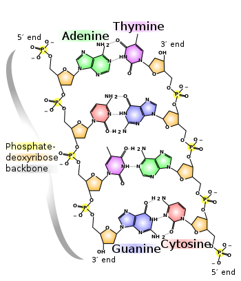

# Classifying-Nucleic-Acid-Sequence-Using-GRU

Tensorflow 2.0 implementation of classification of the genetic code sequence. Genetic code has form of Nucleobases sequence (A C T G). We use GRU cells (Gated Recurrent Units) to classyfie given sequence to one of five classes. 

The obtained results are surprisingly good, thanks to usage of GRU cells it was possible to achive about 100% accuracy on boh validation set and training set. 



## Getting Started

To run it You need jupyter notebook installed or You can run it using [google colab](https://colab.research.google.com)
The main file is [Classifying-Nucleic-Acid-Sequence.ipynb](Classifying-Nucleic-Acid-Sequence.ipynb)

### Prerequisites
```
-tensorflow 2.0
-numpy
-tqdm
-matplotlib
```
## Data
Data used in this repo was taken from FU Berin Deep Learnig Course (Prof. Frank Noé Sommer Semeter 2019) 

## Authors
* [tugot17](https://github.com/tugot17)

## License

This project is licensed under the MIT License - see the [LICENSE.md](LICENSE.md) file for details
